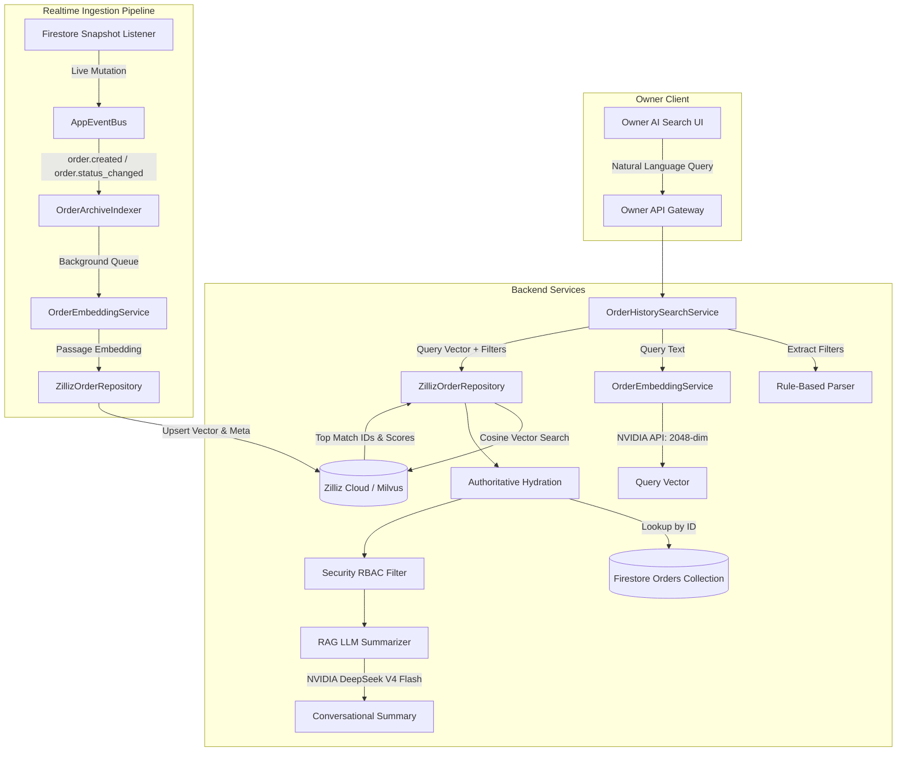

# Olive Pizza — Owner AI Order History Search Engine

> **Subsystem**: Owner Intelligent Order Search & Semantic Vector Archive  
> **Vector Engine**: Zilliz Cloud (Milvus) / Collection: `Olive_Pizza_orders`  
> **Embedding Model**: NVIDIA Nemotron Embed 1B (`nvidia/nemotron-3-embed-1b`, 2048-dim, `COSINE`)  
> **RAG LLM**: DeepSeek V4 Flash (`deepseek-ai/deepseek-v4-flash-0731`)  
> **Backend Integration**: `olive-pizza-owner/backend`  
> **Frontend Interface**: `olive-pizza-owner/frontend` (`/ai-order-history`)

---

## 1. Overview & Business Value

The **Owner AI Order History Search** is a multi-tier, hybrid search engine that indexes every archived and live order across all Olive Pizza franchises and branches into high-dimensional vector space.

### Key Capabilities:
1. **Natural Language Query Understanding**: Converts colloquial queries (e.g. *"Show July orders from Civil Lines with Farmhouse and UPI around ₹850"*) into semantic vector representations paired with extracted structured filters.
2. **Exact Order ID Routing**: Instantly recognizes order identifiers (`#OP-10482` or UUIDs) and routes to exact single-lookup without vector noise.
3. **Zero-Hallucination RAG**: The AI summary assistant operates under strict context limits, only summarizing hydrated, authoritative order records from Firestore and database archives.
4. **Multi-Franchise RBAC Scoping**: Enforces boundary isolation. Owners have global visibility across all franchises; restaurant managers and franchise admins are strictly isolated to their assigned units.
5. **Non-Blocking Realtime Indexing**: Emits and captures `order.created` and `order.status_changed` domain events on the internal `appEventBus`, asynchronously embedding and upserting orders without blocking client checkout latency.

---

## 2. Architecture Diagram



---

## 3. Vector Database Schema (`Olive_Pizza_orders`)

| Field Name | Type | Dimension / Length | Description |
| :--- | :--- | :--- | :--- |
| `order_id` | `DataType.VarChar` | Max 64 (PK) | Unique Order ID (e.g. `OP-10482`) |
| `vector` | `DataType.FloatVector` | 2048 | NVIDIA Nemotron 1B Embedding |
| `customer_id` | `DataType.VarChar` | Max 64 | Customer UUID |
| `customer_name` | `DataType.VarChar` | Max 128 | Customer Full Name |
| `customer_phone` | `DataType.VarChar` | Max 32 | Customer Phone Number |
| `franchise_id` | `DataType.VarChar` | Max 64 | Franchise ID (e.g. `franchise-rjn`) |
| `franchise_name` | `DataType.VarChar` | Max 128 | Franchise Name (e.g. `Rajnandgaon`) |
| `branch_id` | `DataType.VarChar` | Max 64 | Branch ID (e.g. `branch-civil-lines`) |
| `branch_name` | `DataType.VarChar` | Max 128 | Branch Name (e.g. `Civil Lines`) |
| `order_date` | `DataType.VarChar` | Max 32 | Date string (`YYYY-MM-DD`) |
| `order_timestamp`| `DataType.Int64` | - | Milliseconds epoch |
| `status` | `DataType.VarChar` | Max 32 | Order status (`delivered`, `cancelled`) |
| `total_amount` | `DataType.Float` | - | Final Order Total Amount |
| `payment_method` | `DataType.VarChar` | Max 32 | Payment method (`UPI`, `Cash`, `Card`) |
| `product_names` | `DataType.VarChar` | Max 512 | Comma-separated item names |
| `order_text` | `DataType.VarChar` | Max 2048 | Formatted semantic passage text |
| `embedding_version`| `DataType.VarChar`| Max 32 | Index version (`v1-nemotron-2048`) |

---

## 4. API Endpoints Reference

### 1. `POST /api/owner/order-history/search`
Executes hybrid semantic search with RAG summarization.
- **Auth**: Bearer Token (Role: `owner`, `admin`, `restaurant_manager`)
- **Request Body**:
```json
{
  "query": "Show delivered UPI orders from Civil Lines around ₹850",
  "filters": {
    "status": "delivered",
    "paymentMethod": "UPI",
    "minAmount": 700,
    "maxAmount": 1000
  },
  "pagination": { "limit": 15 }
}
```
- **Response**:
```json
{
  "success": true,
  "data": {
    "query": "Show delivered UPI orders from Civil Lines around ₹850",
    "parsedFilters": {
      "status": "delivered",
      "payment_method": "UPI",
      "branch_name": "Civil Lines",
      "min_amount": 700,
      "max_amount": 1000
    },
    "aiSummary": "Found 1 matching order (#OP-10482) placed at Civil Lines for ₹850 via UPI containing Farmhouse Pizza and Garlic Breadsticks.",
    "totalMatches": 1,
    "results": [
      {
        "orderId": "OP-10482",
        "customerName": "Aarav Sharma",
        "branchName": "Civil Lines",
        "franchiseName": "Rajnandgaon",
        "orderDate": "2026-08-14",
        "status": "delivered",
        "paymentMethod": "UPI",
        "totalAmount": 850,
        "items": [
          { "name": "Farmhouse Pizza", "quantity": 1, "size": "Large", "crust": "Cheese Burst", "price": 750 },
          { "name": "Garlic Breadsticks", "quantity": 1, "price": 100 }
        ],
        "source": "verified_archive"
      }
    ],
    "searchMode": "hybrid_semantic",
    "latencyMs": 142
  }
}
```

### 2. `POST /api/owner/order-history/index-order`
Manually index a single order.
- **Auth**: Owner/Admin only.

### 3. `POST /api/owner/order-history/backfill`
Batch index historical orders from Firestore archive into Zilliz Vector DB.
- **Request Body**: `{ "limit": 100 }`

### 4. `GET /api/owner/order-history/status`
Returns Vector DB connection status, active dimension, and index counts.

---

## 5. Security & Isolation Matrix

| Capability | Owner / Admin | Franchise Admin | Restaurant Manager |
| :--- | :--- | :--- | :--- |
| **All-Franchise Global Search** | ✅ Yes | ❌ No | ❌ No |
| **Franchise-Scoped Search** | ✅ Yes | ✅ Yes (Own Only) | ❌ No |
| **Branch-Scoped Search** | ✅ Yes | ✅ Yes (Within Franchise)| ✅ Yes (Own Branch Only) |
| **Manual Backfill Trigger** | ✅ Yes | ❌ No | ❌ No |
| **Direct Vector Deletion** | ✅ Yes | ❌ No | ❌ No |

---

## 6. Test Suite & Verification Results

Integration test suite executed at `src/tests/testOrderHistoryZilliz.ts`:
- **OrderEmbeddingService**: 2048-dim validation, text passage format.
- **ZillizOrderRepository**: Upsert, load sync, metadata query filtering.
- **OrderHistorySearchService**: Exact match routing, RAG summarization, filter extraction.
- **Security & Multi-Franchise**: Cross-franchise isolation, prompt injection defense, anti-hallucination.

**Result**: `TOTAL TESTS: 22 | PASSED: 22 | FAILED: 0 (100% Success)`.
