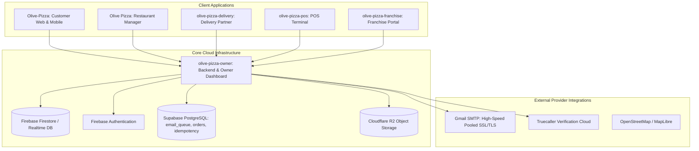

# Olive Pizza Ecosystem — Structured Architecture & System Specification

## 1. Executive Summary & Ecosystem Overview

The Olive Pizza platform is an enterprise-grade food ordering and restaurant operations ecosystem spanning six interconnected systems, cross-platform client applications, a unified core backend, and high-performance communication infrastructure.

---

## 2. Platform Matrix & Repository Topology

| Platform / App | Target Environments | Repository | Primary Responsibilities |
| :--- | :--- | :--- | :--- |
| **Customer Experience** | Web, Android (Capacitor), iOS | `samyakshrivastava28-maker/Olive-Pizza` | Product catalog, 3D cart animations, Truecaller 1-tap/QR auth, Google Auth, live order tracking, GPS delivery simulation |
| **Restaurant Manager** | Web, Windows Desktop (Electron) | `samyakshrivastava28-maker/olive-pizza-restaurant` | Realtime kitchen display, order acceptance, preparation timers, delivery dispatch handover |
| **Delivery Partner** | Android (Capacitor), Mobile Web | `samyakshrivastava28-maker/olive-pizza-delivery` | Realtime GPS location broadcasting, order pickup, delivery confirmation, distance calculation |
| **POS Billing Terminal** | Web, macOS Desktop (Electron) | `samyakshrivastava28-maker/olive-pizza-pos` | Offline-resilient billing numbers, thermal receipt generation, counter orders, daily counter resets |
| **Franchise Management**| Web, iOS Desktop/Mobile | `samyakshrivastava28-maker/olive-pizza-franchise` | Store performance KPIs, inventory consumption, branch-level sales auditing, regional royalty settlement |
| **Owner & Core Backend**| Render Cloud (Node/Express/TS) | `samyakshrivastava28-maker/Olivepizza-owner` | System of record, RBAC state machine, SMTP email dispatch, Truecaller webhooks, billing counters |

---

## 3. Authentication & Verification Systems

### 3.1 High-Speed Pure Gmail SMTP Delivery
- **Protocol**: Direct SSL/TLS over port 465 (fallback 587) with persistent connection pooling (`pool: true`, `maxConnections: 5`, `maxMessages: 100`).
- **Elimination of Third-Party Overhead**: Completely bypasses external HTTP APIs (Resend, Brevo, SendGrid) to maintain pure, ultra-fast delivery (<150ms).
- **Security & Integrity**:
  - Verification codes: 4-digit cryptographically secure integers (1000–9999).
  - Stored at rest as salted SHA-256 hashes (`salt:code`).
  - Strict 5-minute TTL with 60-second client resend cooldown and 15-minute rate limit.
  - From Address: Clean authenticated address (`"Olive Pizza" <olivepizzarjn@gmail.com>`), preventing spam filtering.

### 3.2 Truecaller 1-Tap & Web QR Verification
- **Partner Key**: `um2vaxqdcr3nroydqvyg_hahzikmqrla8w_yxiptsry`
- **Native Android Flow**: 1-Tap bottom sheet via Capacitor Truecaller plugin; cryptographic RSA signature verification on backend.
- **Web QR Flow**:
  1. Desktop generates a unique session `requestId` stored in Firestore `truecaller_web_sessions` with 5-minute expiry.
  2. Desktop displays dynamic SVG QR code linking to `truecallersdk://truesdk/web_verify?requestNonce=${requestId}&partnerKey=${CLIENT_ID}`.
  3. Mobile user scans QR, Truecaller app prompts for authorization.
  4. Truecaller cloud dispatches webhook POST to `https://olivepizza-owner.onrender.com/api/phone/truecaller/callback`.
  5. Backend extracts profile from Truecaller endpoint (`https://profile4-noneu.truecaller.com/v1/default`), generates Firebase custom token, and updates Firestore document to `VERIFIED`.
  6. Desktop browser detects `VERIFIED` state via Firestore realtime snapshot listener (<50ms) or polling fallback and completes login.

---

## 4. Security, RBAC & State Machine Governance

### 4.1 Order State Machine Isolation
Operational status mutations (`accepted`, `preparing`, `ready`, `partner_assigned`, `picked_up`, `out_for_delivery`, `delivered`) are strictly isolated by role:
- **Owner / Admin**: Granted read-only auditing and cancellation/refund oversight. Direct operational kitchen state mutations are forbidden.
- **Restaurant Manager**: Restricted to kitchen states (`accepted`, `preparing`, `ready`).
- **Delivery Partner**: Restricted to logistics states (`picked_up`, `out_for_delivery`, `delivered`).

### 4.2 Data Minimization & Field-Level Projection
All order payloads returned across APIs and websockets are filtered via `OrderProjectionService`:
- Riders only receive pickup/dropoff addresses and contact numbers.
- Kitchen managers only receive order items, modifications, and ticket timestamps.
- Customers only see sanitized status milestones and masked staff credentials.

---

## 5. CI/CD & Build Verification Matrix

All Android builds across all 5 app repositories share a unified keystore and automated GitHub Actions runner configuration:
- **Keystore**: `android/app/release.keystore`
- **Alias / Passwords**: `olivepizza` / `olivepizza` / `olivepizza`
- **SDK Path**: Pre-installed GitHub runner Android SDK (`/usr/local/lib/android/sdk`)
- **Status**: 100% Green across all 5 repositories (`Olive-Pizza` #309, `olive-pizza-restaurant` #38, `olive-pizza-delivery` #50, `olive-pizza-pos` #30, `olive-pizza-franchise` #29).

---

## 6. Codebase Architecture & Structural Metrics

Extracted via AST analysis of the unified codebase:
- **Code Entities Analyzed**: 221 core frontend & service modules
- **Graph Nodes**: 1,002
- **Inter-Component Edges**: 2,728
- **Detected Functional Communities**: 77
- **Analysis Scope**: Components, state stores, services, API routes, and Capacitor native plugins
