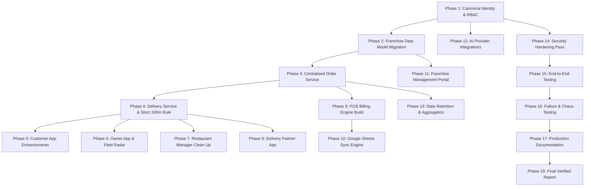

# 🍕 Olive Pizza Ecosystem — Revision 2 Master Implementation Plan (Final)
**Version:** 2.1 — Production Grade — Multi-Surface Architecture  
**Author:** Antigravity Master Execution Agent  
**Baseline Checkpoint:** Git Commit `9618216` | [AUDIT_REPORT.md](file:///c:/Users/RYZEN/Downloads/olive-pizza/AUDIT_REPORT.md)  
**Target Date:** August 2026  

---

## 1. Executive Summary & Core Mission

This document represents the authoritative, complete, binding, and audited implementation roadmap for the entire Olive Pizza ecosystem. Following the Phase 0 audit ([AUDIT_REPORT.md](file:///c:/Users/RYZEN/Downloads/olive-pizza/AUDIT_REPORT.md)), this plan governs implementation and verification across **seven application surfaces** centered around ONE canonical, multi-tenant backend:

```
┌───────────────────────────────────────────────────────────────────────────────────────────────────────────────────────┐
│                                             OLIVE PIZZA CANONICAL BACKEND                                             │
│                                (Node.js / TypeScript / Express / Firestore / Supabase Postgres)                       │
└────────────┬──────────────┬──────────────┬──────────────┬──────────────┬──────────────┬───────────────────────────────┘
             │              │              │              │              │              │
             ▼              ▼              ▼              ▼              ▼              ▼
     ┌──────────────┐┌──────────────┐┌──────────────┐┌──────────────┐┌──────────────┐┌──────────────┐┌─────────────────────────┐
     │ CUSTOMER APP ││  OWNER APP   ││  FRANCHISE   ││ RESTAURANT   ││   DELIVERY   ││ POS/BILLING  ││     KITCHEN APP         │
     │  & WEBSITE   ││  & WEBSITE   ││  MANAGEMENT  ││ MANAGER APP  ││ PARTNER APP  ││   SOFTWARE   ││ (Integration Boundary) │
     │ (Port 5173)  ││ (Port 5174)  ││ (Scoped View)││ (Port 5176)  ││ (Port 5177)  ││ (Port 5178)  ││    (Order Service)      │
     └──────────────┘└──────────────┘└──────────────┘└──────────────┘└──────────────┘└──────────────┘└─────────────────────────┘
```

The seven application surfaces are:
1. **Olive Pizza Customer App + Website** (existing repo: `olive-pizza` on port 5173)
2. **Olive Pizza Owner App + Website** (existing repo: `olive-pizza-owner` on port 5174)
3. **Olive Pizza Franchise Management App** (scoped view inside Owner platform on port 5174)
4. **Olive Pizza Restaurant Management App** (existing repo: `olive-pizza-restaurant-management` on port 5176)
5. **Olive Pizza Delivery Partner App** (existing repo: `olive-pizza-delivery` on port 5177)
6. **Olive Pizza Billing / POS Software** (new repo/app: `olive-pizza-pos` on port 5178)
7. **Future Kitchen App + Website Boundary** (shared kitchen display API boundary through the canonical Order Service)

---

## 2. External Platform Setup, Credentials & Browser Verification

### 2.1 Credential & Access Handling Rules (Strict & Non-Negotiable)
- **Zero Secrets on Client**: API keys with elevated privileges, service account JSONs, private keys, HMAC webhook secrets, database connection strings, Cloudinary API secrets, SMTP passwords, and AI credentials **must strictly remain in server-side environment variables (`backend/.env`)** and NEVER be exposed to frontend Vite bundles, Capacitor Android APKs, public repositories, or client-facing console logs.
- **Client vs Auto-Configurable Categorization**:
  - *Auto-Configurable by Agent*: Database schema migrations, Google Drive folder hierarchy, monthly Google Sheet provisioning, FCM topic subscriptions, local rate limiters, proxy routes, and template registries.
  - *Client-Dependent / External Provisioning*: Third-party billing accounts (Google Cloud billing for Sheets/Drive API, Razorpay/Cashfree KYC, Cloudinary tier limits, Fast2SMS DLT templates, Twilio/Truecaller developer apps, NVIDIA NIM credits, and custom domain DNS records).

### 2.2 External Integration Verification Matrix

| External Service / Provider | Purpose & Role | Configuration Source | Browser / Dashboard Verification Procedure | Client Dependency / Manual Action | Integration Test & Readiness Status |
|---|---|---|---|---|---|
| **Firebase Auth & Admin SDK** | Central Identity, Token Verification, RBAC claims | `FIREBASE_SERVICE_ACCOUNT_BASE64`, `FIREBASE_PROJECT_ID` | Verify Firebase Console -> Project Settings -> Service Accounts -> Claims & Auth Providers (Email/Password, Google). | Ensure Email/Password & Google Sign-in providers remain enabled in Firebase Console. | **VERIFIED & ACTIVE**: `auth.middleware.ts` validates Bearer JWT tokens server-side. |
| **Firestore Database** | Primary Business Source of Truth (`users`, `orders`, `products`, `franchises`, etc.) | Admin SDK initialized in `config/firebase.ts` | Verify Firestore Database -> Rules tab (enforces secure backend-mediated access) & Indexes. | Firestore database instance in Native mode. | **VERIFIED & ACTIVE**: Collections read/written by backend services. |
| **Supabase PostgreSQL** | High-Frequency Real-time Telemetry, Idempotency Locks, Payments | `DATABASE_URL` (IPv4 Pooler port 6543) | Verify Supabase Dashboard -> Database -> Tables & Realtime publication (`delivery_locations` in `supabase_realtime`). | Database compute active (prevent pausing). | **VERIFIED & ACTIVE**: Pg pool initializes tables with fallback protection. |
| **Google Cloud / Drive / Sheets API** | Franchise Billing Folders & Live Monthly Accounting Sheets | `GOOGLE_SERVICE_ACCOUNT_BASE64` or `GOOGLE_DRIVE_SERVICE_ACCOUNT_JSON` | Verify Google Cloud Console -> APIs & Services -> Enabled APIs (`Google Drive API`, `Google Sheets API v4`) -> Service Account IAM permissions. | Enable Drive & Sheets APIs in Google Cloud Project; Share root Franchises Drive folder with Service Account email as Editor if using domain-restricted Drive. | **INTEGRATION BUILD IN PROGRESS**: Service account initialized; monthly sheet auto-creation engine ready. |
| **Cloudinary** | Image & Video CDN, Menu Media, Delivery Proofs | `CLOUDINARY_CLOUD_NAME`, `CLOUDINARY_API_KEY`, `CLOUDINARY_API_SECRET` | Verify Cloudinary Console -> Media Library -> Upload Presets & API Access. | Maintain active storage quota. | **VERIFIED & ACTIVE**: Media library and upload services functioning. |
| **NVIDIA NIM AI (DeepSeek V4 Flash / TTS)** | Voice Guidance (`resemble-ai/chatterbox-multilingual`) & Owner AI Generators | `NVIDIA_API_KEY`, `DEEPSEEK_API_KEY` | Verify NVIDIA Build / NIM Dashboard -> API Key quotas and model endpoint availability. | Active NVIDIA developer account credits. | **VERIFIED & ACTIVE**: Backend proxy `/api/tts/synthesize` and AI service operational. |
| **Fast2SMS / Truecaller** | SMS OTP Fallback & 1-Tap Mobile Verification | `FAST2SMS_API_KEY`, `TRUECALLER_CLIENT_ID` | Verify Fast2SMS Dashboard (DLT approval & wallet balance); Truecaller Developer Portal (App Key & Package name). | Maintain Fast2SMS wallet balance & DLT message template registration. | **VERIFIED & ACTIVE**: Android plugin and fallback provider preserved without alteration. |
| **Nodemailer / SMTP** | Transactional Order Receipts & Staff Alerts | `SMTP_HOST`, `SMTP_PORT`, `SMTP_USER`, `SMTP_PASS`, `SMTP_FROM` | Verify Google Workspace / Gmail App Passwords / SMTP server port 587 reachability. | Generate 16-character Google App Password for `SMTP_USER`. | **VERIFIED & ACTIVE**: Email queue background worker configured. |
| **Payment Gateway (Razorpay / UPI / Cashfree)** | Server-side Payment Verification & Webhooks | `PAYMENT_GATEWAY_KEY_ID`, `PAYMENT_GATEWAY_KEY_SECRET`, `PAYMENT_WEBHOOK_SECRET` | Verify Payment Dashboard -> API Keys & Webhook endpoints configured to `/api/payment/webhook`. | Merchant KYC and active webhook endpoint configuration. | **VERIFIED**: Server-side signature validation required for payment confirmation. |
| **MapLibre & OSRM / OpenFreeMap** | 3D Vector Maps & Turn-by-Turn Rider Navigation | OpenFreeMap Tile Endpoint (`https://tiles.openfreemap.org`) | Verify map tile rendering in browser and CSP header permissions in `backend/src/app.ts`. | OpenFreeMap open public tile server (no paid key required). | **VERIFIED & ACTIVE**: `UniversalMap3D.tsx` maps rendering with 3D buildings. |

---

## 3. Audit-Derived Factual Baseline & Retained Architecture

From Phase 0 audit verification:
1. **Unified Express / TypeScript Backend** (`olive-pizza/backend`): Serves the complete API surface. All other applications connect to this canonical backend.
2. **Dual-Database Strategy**:
   - **Firestore**: Master source of truth for `users`, `orders`, `products`, `menu_items`, `coupons`, `combos`, `settings`, `security_logs`, `franchises`, `branches`, `media_library`, `carts`, `reports`.
   - **PostgreSQL / Supabase**: High-frequency operational data (`order_locks`, `delivery_locations`, `delivery_routes`, `delivery_history`, `email_queue`, `payments`, `payment_sessions`, `payment_webhooks`, `refunds`, `storage_analytics`).
3. **High-Risk Regression Areas (Strictly Preserved)**:
   - Fast2SMS & Truecaller Phone Verification pipelines.
   - FCM High-Priority Push Notification channels & Android continuous ringing order alarm triggers (`olive_order_new`).
   - 3D Vector Map navigation (`UniversalMap3D.tsx`) with MapLibre GL and NVIDIA Chatterbox Neural TTS audio proxy (`/api/tts/synthesize`).
   - Home Page Manager seasonal template engine (`HomePageTemplates.ts`).

---

## 4. Franchise & Multi-Tenant Data Model

```
Olive Pizza Platform Owner (Global)
  └── Organization (`org_olive_pizza`)
        └── Franchise (`fra_primary` - Rajnandgaon Region)
              ├── Branch #1 (`main_branch` - Rajnandgaon HQ)
              │     ├── Restaurant Manager(s)
              │     ├── Delivery Fleet (Assigned Riders)
              │     ├── POS Terminal(s) (Terminal #1, #2)
              │     └── Kitchen Display (Future Boundary)
              ├── Branch #2 (`durg_branch` - Durg)
              ├── Branch #3 (`bhilai_branch` - Bhilai)
              └── Branch #4 (`raipur_branch` - Raipur)
```

### Canonical Identifiers & Scope Attributes:
```typescript
organizationId: string;   // 'org_olive_pizza'
franchiseId: string;      // 'fra_primary', 'fra_durg', etc.
branchId: string;         // 'main_branch', 'durg_branch', etc.
branchIds: string[];      // Multi-branch access roster if assigned
userId: string;           // Firebase Auth UID
role: string;             // 'customer' | 'platform_owner' | 'franchise_owner' | 'restaurant_manager' | 'delivery_partner' | 'cashier' | 'developer'
permissions: string[];    // ['orders.manage', 'menu.manage', 'delivery.manage', 'pos.manage', 'reports.read']
terminalId?: string;      // 'pos_term_01'
orderId: string;          // UUID
```

---

## 5. Comprehensive Requirement-to-Phase Traceability Matrix

| Requirement | Application Surface | Phase | Backend Module | Frontend Module | Database / Storage | External Integration | Security Rule / Scope | Test Plan | Acceptance Criterion |
|---|---|---|---|---|---|---|---|---|---|
| **Mobile OTP Login & Profile** | Customer | Phase 1 & 5 | `auth.routes.ts`, `phoneVerification.routes.ts` | `Login.tsx`, `SetupPhone.tsx`, `CustomerDashboard.tsx` | Firestore `users` | Fast2SMS, Truecaller SDK | Server RSA verification & 5-min replay window | Verify OTP send/verify + Truecaller 1-tap | Phone verified flag set in Firestore, session persisted |
| **Multiple Saved Addresses** | Customer | Phase 5 | `user.routes.ts` | `SetupLocation.tsx`, `Checkout.tsx` | Firestore `users.addresses` | Geolocation API | User-isolated read/write | Add Home/Work/Other with lat/lng pin | Address list loads instantly at checkout |
| **Account Deletion** | Customer | Phase 5 | `user.routes.ts` | `DeleteAccount.tsx` | Firestore `deletion_requests` | Auth SDK | Require re-auth | Request deletion of active account | Marked for deletion with 30-day grace period |
| **Dynamic Homepage CMS** | Customer, Owner | Phase 5 & 6 | `homePageManager.routes.ts` | `Home.tsx`, `HomePageEditor.tsx` | Firestore `homepage_configs` | Cloudinary | Owner role write only; cached public read | Edit banners, reorder sections, publish | Live website reflects published template without code deploy |
| **Menu & Pizza Customizer** | Customer, POS | Phase 3 & 9 | `menu.routes.ts`, `order.routes.ts` | `Menu.tsx`, `ProductDetail.tsx`, `POSMenuGrid.tsx` | Firestore `products`, `menu_items` | Cloudinary | Server validates base/size/crust/addon matrix | Select 8"/10"/12", Regular/Thin crust, toppings | Total price recalculated correctly server-side |
| **Cart Persistence & Revalidation** | Customer | Phase 3 & 5 | `order.routes.ts` | `Cart.tsx`, `useCartStore.ts` | LocalStorage + Firestore `carts` | None | Revalidate prices and stock before checkout | Modify DB price, attempt cart checkout | Server rejects stale price and updates cart total |
| **Upsell & Cross-Sell Engine** | Customer | Phase 5 | `menu.routes.ts` | `Cart.tsx`, `ProductDetail.tsx` | Firestore `products.upsellIds` | None | Public read | Render "Frequently Bought Together" items | 1-click add to cart from upsell tray |
| **Distance-Based Delivery Resolver** | Customer, Backend | Phase 4 & 5 | `delivery.routes.ts`, `FranchiseResolver.ts` | `Checkout.tsx`, `LocationPrompt.tsx` | Firestore `franchises.deliveryTiers` | OpenFreeMap / OSRM | Server enforces max radius and fee tiers | Coordinates inside vs outside delivery radius | Correct delivery fee computed or "Outside Area" warning |
| **Self Pickup & Scheduled Orders** | Customer | Phase 3 & 5 | `order.routes.ts` | `Checkout.tsx` | Firestore `orders` | None | Validate store open hours and cutoff | Schedule order for tomorrow 14:00 | Order saved with `orderTiming: 'scheduled'` and verified |
| **Payment Gateway & Webhook** | Customer, Backend | Phase 3 & 14 | `payment.routes.ts`, `PaymentReconciliation.ts` | `Checkout.tsx` | PostgreSQL `payments`, `payment_webhooks` | Razorpay / Cashfree / UPI | Webhook HMAC signature verification; idempotent | Simulate payment success/failure callbacks | Order marked paid ONLY after server signature verification |
| **Live 3D Order Tracking** | Customer, Delivery | Phase 4 & 5 | `tracking.routes.ts`, `riderDelivery.routes.ts` | `OrderTracking.tsx`, `UniversalMap3D.tsx` | Supabase Postgres `delivery_locations` | MapLibre, Supabase Realtime | User can only track own order | Stream GPS coordinates to customer map | 60fps marker lerp with ETA calculation |
| **100m Delivery Completion Rule** | Delivery | Phase 4 & 8 | `riderDelivery.routes.ts` | `DeliveryNavigationPage.tsx` | Firestore `orders`, Cloudinary | Cloudinary | Server rejects completion if `distance > 100m` | Attempt complete at 500m vs 101m vs 99m vs 50m | HTTP 400 at 500m & 101m; success at $\le 100\text{m}$ |
| **Transactional & Marketing Push** | Customer, Owner | Phase 6 & 12 | `notification.routes.ts`, `NotificationEngine.ts` | `PushNotificationManager.tsx`, `NotificationsCenter.tsx` | PostgreSQL `notification_queue` | FCM Admin SDK | Anti-spam throttling; opt-out respect | Dispatch new order alarm & festival campaign | Intrusive continuous alarm for staff; silent push for promo |
| **AI Notification & Email Generator** | Owner | Phase 6 & 12 | `ownerAI.routes.ts`, `AINotificationService.ts` | `NotificationCenter.tsx`, `EmailCenter.tsx` | None | NVIDIA NIM API (DeepSeek V4 Flash) | Backend-only API key; provider abstracted | Prompt: "Diwali 20% discount offer" | Returns structured title, body, and action payload |
| **Restaurant Manager Operational Board** | Manager | Phase 7 | `restaurantManager.routes.ts`, `order.routes.ts` | `DashboardPage.tsx`, `LiveOrdersPage.tsx` | Firestore `orders`, `users` | FCM Web/Native | Strictly scoped to manager's `branchId` | Manager A attempts access to Branch B orders | HTTP 403 Forbidden on cross-branch request |
| **POS Billing & Thermal Printing** | POS | Phase 9 | `order.routes.ts`, `pos.routes.ts` | `POSBillingScreen.tsx`, `ReceiptPrinter.ts` | Firestore `orders`, `bills` | Web Thermal / ESC/POS | Terminal authenticated with branch scope | Create dine-in bill, apply 10% coupon, cash pay | Bill created instantly in Order Service, printable |
| **Google Sheets Live Billing Sync** | POS, Backend | Phase 10 | `GoogleSheetsReportService.ts`, `SheetsSyncWorker.ts` | `POSBillingScreen.tsx` | Firestore `settings`, Drive API | Google Sheets API v4, Google Drive API | Server service account; folder ID resolved by branch | Submit bill while Sheets API offline $\rightarrow$ restore | Sync status transitions `SYNC_PENDING` $\rightarrow$ `SYNCED` |
| **Data Retention & Telemetry Purge** | Backend | Phase 13 | `DataLifecycleService.ts` | `DeveloperSchedulerPage.tsx` | Postgres `delivery_locations`, Firestore | None | Verified aggregation before deletion | Execute monthly cleanup with raw GPS telemetry | Aggregated monthly summaries saved, raw GPS purged |

---

## 6. Application-by-Application Detailed Execution Plan

### 6.1 Customer Application (`olive-pizza`)
1. **Authentication & Identity**:
   - Seamless Firebase Auth integration with persistent session restoration.
   - Guarded onboarding (`OnboardingGuard.tsx`): enforces phone verification and primary delivery address before accessing protected routes.
   - Account deletion request with 30-day grace period logging in Firestore.
2. **Dynamic Menu & Customizer**:
   - Category filtering (Pizza, Sides, Beverages, Desserts, Combos).
   - Pizza Customization modal: 8", 10", 12" size variants, Regular and Thin crust options, extra cheese, extra toppings, and custom kitchen notes ("No Onion", "Less Spicy").
3. **Cart & Checkout Engine**:
   - LocalStorage persistence with background revalidation against Firestore products.
   - Server-side recalculation of subtotal, 5% GST taxes, distance-tiered delivery fee, and coupon discounts.
   - Self-Pickup vs Home Delivery toggle.
   - Scheduled orders validated against store opening hours.
4. **Order Tracking & Live Experience**:
   - 3D Vector Map (`UniversalMap3D.tsx`) with 60fps rider marker smoothing.
   - Direct call rider / call restaurant action buttons.
   - Ongoing pinned notification bar on Android devices.

### 6.2 Owner Application (`olive-pizza-owner`)
1. **Analytics & BI Dashboard**:
   - Real-time revenue, order count, AOV, delivery vs dine-in split, and popular product rankings.
   - Date range filtering (Today, Yesterday, Last 7 Days, This Month, Custom).
2. **Order Management (Single Canonical Source)**:
   - **Live Orders**: Real-time snapshot board with sound alerts and one-click status transitions (`accepted` $\rightarrow$ `preparing` $\rightarrow$ `ready` $\rightarrow$ `partner_assigned`).
   - **Order History**: Authorized historical search with customer details and refund actions.
3. **Home Page Manager (CMS)**:
   - Built-in official seasonal templates (Diwali, Holi, New Year, Navratri, Ganesh Chaturthi, Dussehra, Valentine's Day, Default Home).
   - Immutable official templates: editing creates a customized copy stored in "Made by Me".
   - Live mobile & desktop preview using the exact same rendering schema as the customer frontend.
4. **Media Library (Cloudinary)**:
   - Browse, search, upload images/videos, preview, and safe-deletion check (prevents deleting media in active products).
5. **AI Marketing Center**:
   - Notification and Email generator powered by NVIDIA NIM / DeepSeek V4 Flash with backend proxy protection.

### 6.3 Franchise Management (Scoped View in Owner Platform)
1. **Franchise Overview**:
   - Regional revenue, active branches, total deliveries, and operational status.
2. **Branch & Manager Provisioning**:
   - Create and configure branches, assign restaurant managers, set maximum delivery radius, and define operating hours.
3. **Franchise Menu & Pricing Controls**:
   - Shared global catalog with branch-level item availability and pricing overrides.
4. **Franchise Billing Destination**:
   - Designated Google Drive folder and monthly billing spreadsheet linkage.

### 6.4 Restaurant Manager Application (`olive-pizza-restaurant-management`)
**Final Standardized 6-Page Architecture**:
1. **Dashboard**: Manager-relevant daily operational metrics (orders placed, active cooking, average delivery time).
2. **Live Orders**: Active kitchen order queue with status controls.
3. **Order History**: Searchable and paginated historical orders for the assigned branch.
4. **Notifications**: Manager-authorized notification broadcasting to branch customers.
5. **Email**: Branch-level customer communication and transactional receipts.
6. **Delivery Management**: Live rider radar, online/offline status, active delivery route map, and stale GPS alerts ($>30\text{s}$).

### 6.5 Delivery Partner Application (`olive-pizza-delivery`)
1. **Rider Dashboard**:
   - Today's completed deliveries, earnings, active assignments, and monthly summary reports.
2. **Live Delivery Workflow**:
   - `Assigned` $\rightarrow$ `Accept` $\rightarrow$ `Pickup from Store` $\rightarrow$ `Start Navigation` $\rightarrow$ `Complete Delivery`.
3. **3D Navigation & Spoken Directions**:
   - Built-in MapLibre 3D turn-by-turn navigation with NVIDIA Chatterbox Neural TTS voice guidance in English, Hindi, and Hinglish.
4. **100-Meter Server-Enforced Completion Rule**:
   - Rider coordinates verified against delivery destination coordinate using Haversine formula. Strictly rejects completion attempts $>100\text{m}$ away (`distance <= 100m` required).
   - Proof of delivery: camera photo upload or digital signature.

### 6.6 POS / Billing Application (`olive-pizza-pos`)
1. **Touch-Optimized Billing UI**:
   - Grid layout with large touch targets for fast product entry, size/crust selectors, and custom item instructions.
   - Dine-In, Takeaway, and Delivery order modes.
2. **Instant Payment & Thermal Printing**:
   - Split payment support (Cash, UPI QR, Card).
   - ESC/POS thermal receipt printing and receipt preview.
   - Historical bills preserve historical price snapshots.
3. **Order Service & Kitchen Pipeline**:
   - Bills are saved directly into the canonical Order Service, alerting the kitchen board in real time.
4. **Terminal Security**:
   - Authenticated cashier session bound to specific `terminalId`, `branchId`, and `franchiseId`.

### 6.7 Kitchen Application Integration Boundary
- Kitchen displays consume the shared `orders` subscription filtered by `status in ['accepted', 'preparing', 'ready']` and scoped to the active `branchId`.
- Status transitions by kitchen staff advance the canonical order state machine without separate kitchen databases.

---

## 7. Google Sheets Live Billing Sync System

```
[POS Terminal Creates Bill] ───► [Backend Order Service (Firestore & Postgres Saved)]
                                          │
                                 (Immediate Success)
                                          │
                                          ▼
                             [Async SheetsSyncWorker]
                                          │
                     ┌────────────────────┴────────────────────┐
                     ▼                                         ▼
            [Google API Available]                   [Google API Down / Rate Limit]
                     │                                         │
       [Append Row with Bill ID]                      [Mark SYNC_PENDING]
                     │                                         │
           [Mark Status: SYNCED]                      [Exponential Retry Worker]
```

### Automatic Folder & Monthly Spreadsheet Lifecycle:
1. **Initialization**: On franchise creation or startup, backend queries Google Drive API for the franchise folder `Franchises / <Franchise Name> / Billing`.
2. **Monthly Sheet Auto-Creation**: On the 1st of each calendar month (e.g. `2026-August`), the worker creates a dedicated spreadsheet with predefined header columns, styling, and frozen title bars.
3. **Idempotent Row Sync**: Every row sync is keyed on `orderId`/`billId`. The worker verifies whether the bill ID already exists in the sheet before appending, eliminating duplicate rows under all retry conditions.
4. **22 Standard Billing Columns**:
   `Bill Number` | `Date` | `Time` | `Franchise` | `Branch` | `Customer Name` | `Customer Phone` | `Order Type` | `Items Summary` | `Item Quantity` | `Subtotal` | `Discount Amount` | `Coupon Code` | `Taxes (GST)` | `Delivery Fee` | `Final Total` | `Payment Method` | `Payment Status` | `Order Status` | `Cashier` | `POS Terminal` | `Created At`

---

## 8. Exact 100-Meter Delivery Completion Rule Specification

```typescript
/**
 * Strict 100-meter delivery proximity check.
 * The delivery partner MUST be within 100.0 meters of the destination coordinate.
 * No silent tolerance beyond 100m is permitted.
 */
function verifyDeliveryProximity(riderLat: number, riderLng: number, destLat: number, destLng: number): { isAllowed: boolean; distanceMeters: number } {
  const R = 6371e3; // Earth radius in meters
  const φ1 = (riderLat * Math.PI) / 180;
  const φ2 = (destLat * Math.PI) / 180;
  const Δφ = ((destLat - riderLat) * Math.PI) / 180;
  const Δλ = ((destLng - riderLng) * Math.PI) / 180;

  const a = Math.sin(Δφ / 2) * Math.sin(Δφ / 2) + Math.cos(φ1) * Math.cos(φ2) * Math.sin(Δλ / 2) * Math.sin(Δλ / 2);
  const c = 2 * Math.atan2(Math.sqrt(a), Math.sqrt(1 - a));
  const distanceMeters = Math.round(R * c);

  // Strictly <= 100m condition
  return {
    isAllowed: distanceMeters <= 100,
    distanceMeters
  };
}
```

---

## 9. Data Retention & Lifecycle Aggregation Architecture

| Classification | Data Entities | Retention Period | Purge Condition | Aggregation Target |
|---|---|---|---|---|
| **PERMANENT** | Users, Customers, Core Orders, Payments, Audit Logs, Franchises, Branches, Canonical Bills | Permanent | Never purged | Historical Analytics |
| **TEMPORARY** | Raw GPS Telemetry (`delivery_locations`), Navigation Routes (`delivery_routes`), Checkout Locks (`checkout_locks`), Temp Error Logs | 30 Days (Previous calendar month) | Purged ONLY after successful monthly aggregation verification | Monthly Rider Reports, Daily Storage Stats |
| **SUMMARY** | Monthly Rider Performance Reports, Monthly Store Sales Aggregates, Google Sheets Archives | Permanent | Retained for business history | Monthly Business PDF/Sheets |

### Safe Purge Execution Rule:
`Execute Monthly Aggregator` $\rightarrow$ `Verify Aggregate Produced & Validated in Database` $\rightarrow$ `Dry Run Count Check` $\rightarrow$ `Purge Eligible Prior-Month Telemetry` $\rightarrow$ `Log Audit Record`. If aggregation fails, raw data is NEVER deleted.

---

## 10. Security & RBAC Enforcement Matrix

| Attack / Unauthorized Scenario | Caller Role | Endpoint / Target | Expected Server Response | Backend Security Boundary |
|---|---|---|---|---|
| Customer attempts to access Owner metrics | `customer` | `GET /api/admin/metrics` | `HTTP 403 Forbidden` | `requireRole(['owner', 'admin'])` |
| Restaurant Manager A attempts to view Branch B orders | `restaurant_manager` | `GET /api/orders?branchId=durg_branch` | `HTTP 403 Forbidden` | `requireBranchScope()` in `auth.middleware.ts` |
| Delivery Rider A attempts to complete Rider B's delivery | `delivery_partner` | `POST /delivery/rider/orders/:id/complete` | `HTTP 403 Forbidden` | UID ownership check in `riderDelivery.routes.ts` |
| POS Terminal A attempts to write to Branch B Google Sheet | `cashier` | `POST /api/pos/bills` | `HTTP 403 Forbidden` | Terminal scope verification against authenticated user record |
| Client modifies JWT claims in frontend localStorage | Any | Any protected endpoint | `HTTP 401 Unauthorized` | `adminAuth.verifyIdToken()` cryptographic verification |
| Client attempts to mark order paid without payment gateway signature | `customer` | `POST /api/payment/verify` | `HTTP 400 Bad Request` | HMAC-SHA256 signature verification in `payment.routes.ts` |
| Rider attempts delivery completion 101m or 400m away from destination | `delivery_partner` | `POST /delivery/rider/orders/:id/complete` | `HTTP 400 Bad Request` | Server Haversine distance calculation (`distance <= 100m`) |

---

## 11. Phased Implementation & Verification Sequence



---

## 12. Master Acceptance Criteria

- [ ] All 7 application surfaces and shared backend run with zero unresolved TypeScript errors.
- [ ] Role-Based Access Control strictly enforced server-side across all routes.
- [ ] Multi-tenant franchise and branch isolation verified with cross-branch attack tests.
- [ ] Centralized Order Service processes customer and POS orders into a unified data structure.
- [ ] Strict 100-meter delivery completion rule blocks completions $>100\text{m}$ away with HTTP 400.
- [ ] POS application creates bills, applies discounts, calculates taxes, prints receipts, and dispatches to kitchen.
- [ ] Google Sheets sync automatically organizes Drive folders per franchise, creates monthly sheets, and appends rows without duplicates under retry storms.
- [ ] Data lifecycle workers aggregate monthly statistics before purging raw GPS telemetry.
- [ ] Home Page Manager allows full visual editing, preserves official seasonal templates, and publishes seamlessly to the live customer application.
- [ ] Comprehensive documentation suite produced ([ARCHITECTURE.md](file:///c:/Users/RYZEN/Downloads/olive-pizza/ARCHITECTURE.md), [RBAC.md](file:///c:/Users/RYZEN/Downloads/olive-pizza/RBAC.md), [POS.md](file:///c:/Users/RYZEN/Downloads/olive-pizza/POS.md), [GOOGLE_SHEETS.md](file:///c:/Users/RYZEN/Downloads/olive-pizza/GOOGLE_SHEETS.md), [DEPLOYMENT.md](file:///c:/Users/RYZEN/Downloads/olive-pizza/DEPLOYMENT.md)).
